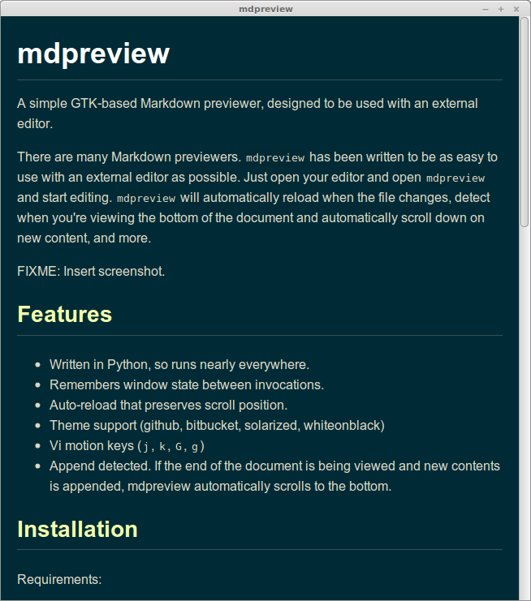

mdpreview
=========

A simple GTK-based Markdown previewer, designed to be used with an external
editor.

There are many Markdown previewers. `mdpreview` has been written to be as easy
to use with an external editor as possible. Just open your editor and open
`mdpreview` and start editing. `mdpreview` will automatically reload when the
file changes, detect when you're viewing the bottom of the document and
automatically scroll down on new content, and more.

Features
--------

* Written in Python, so runs nearly everywhere.
* Remembers window state between invocations.
* Auto-reload that preserves scroll position.
* Theme support (github, bitbucket, solarized, whiteonblack)
* Vi motion keys (`j`, `k`, `G`, `g`)
* Append detected. If the end of the document is being viewed and new contents
  is appended, mdpreview automatically scrolls to the bottom.

Installation
------------

Requirements:

* python-webkit
* python-markdown
* pyinotify (Optional, for fast auto-reloading)

On Debian / Ubuntu systems, to install the dependencies (they're most probably
already installed):

    $ sudo apt-get install python-webkit python-markdown

You can run `mdpreview` directly from the git repository:

    $ git clone https://github.com/fboender/mdpreview
    $ cd mdpreview
    $ ./mdpreview README.md

If you wish to install it on your system, run the `install.sh` script.

Usage
-----

Basic usage:

    Usage: ./mdpreview <file.md>

    Options:
      -h, --help            show this help message and exit
      -k, --keep-on-top     Keep window on top
      -t THEME, --theme=THEME
                            Theme (name or full path to .html). Default: github

### Examples

Using a theme:

    mdpreview -t bitbucket ./README.md

Specify a full path to a theme:

    mdpreview -t ~/.mdpreview/mytheme.html ./README.md

### Keybindings

* **`r`**: Reload
* **`Esc`**, **`q`**: Quit
* **`j`**, **`k`**: Scroll down / up (vi keybindings)
* **`G`**, **`g`**: Scroll to bottom / top (vi keybindings)

### Auto-reloading

mdpreview automatically reloads the Markdown file if it's been changed. It
preserves the scrolling position during reloading.
